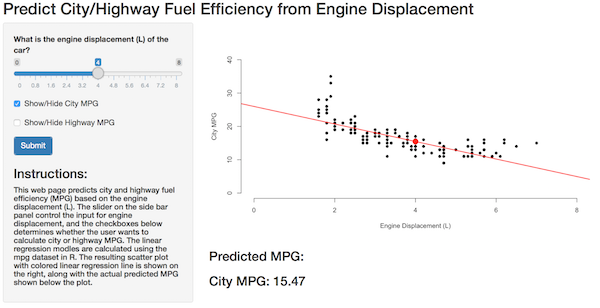

## Background

* The linear regression prediction model is based on the "mpg" dataset in ggplot2.
* The dataset contains the following variables
    + Miles per gallon (MPG) in city
    + MPG on highway
    + Engine displacement
* Goal: to develop an web-based applications for separately predicting MPG for driving in the city versus highway based on engline displacement

--- .class #id 

## Data Structure in R


```r
library(ggplot2)
data(mpg)
str(mpg)
```

```
## Classes 'tbl_df', 'tbl' and 'data.frame':	234 obs. of  11 variables:
##  $ manufacturer: chr  "audi" "audi" "audi" "audi" ...
##  $ model       : chr  "a4" "a4" "a4" "a4" ...
##  $ displ       : num  1.8 1.8 2 2 2.8 2.8 3.1 1.8 1.8 2 ...
##  $ year        : int  1999 1999 2008 2008 1999 1999 2008 1999 1999 2008 ...
##  $ cyl         : int  4 4 4 4 6 6 6 4 4 4 ...
##  $ trans       : chr  "auto(l5)" "manual(m5)" "manual(m6)" "auto(av)" ...
##  $ drv         : chr  "f" "f" "f" "f" ...
##  $ cty         : int  18 21 20 21 16 18 18 18 16 20 ...
##  $ hwy         : int  29 29 31 30 26 26 27 26 25 28 ...
##  $ fl          : chr  "p" "p" "p" "p" ...
##  $ class       : chr  "compact" "compact" "compact" "compact" ...
```

--- .class #id 

## Web-Application Link and Instructions

* [Link to the web-based application](https://cwangm.shinyapps.io/course_project/)
* Instructions:
    + Input: the slider on the side bar panel control the input for engine displacement, with 0.1 L increment
    + Input: the checkboxes below determines whether the user wants to calculate city or highway MPG
    + Output: the resulting scatter plot of MPG vs engine displacement is shown on the right
    + Output: the regression line in color (red for city and blue for hwy) is overlaid on the scatter plot
    + Output: actual predicted MPG is shown below the plot, rounded to 2 decimal points


--- .class #id 


## Example


